# Project Chimera: Research Summary and Architectural Strategy

**Task 1 Deliverable: The Strategist Phase**

| Field | Value |
|-------|-------|
| **Author** | Birkity Yishak |
| **Date** | February 4, 2026 |
| **Context** | Spec-Driven Development, Agentic Orchestration |

> *This document summarizes my research findings and explains the architectural decisions I'm making for Project Chimera.*

---

## Table of Contents

1. [What is Project Chimera?](#what-is-project-chimera)
2. [Part A: Research Summary](#part-a-research-summary)
3. [Part B: My Architectural Decisions](#part-b-my-architectural-decisions)
4. [Part C: Architecture Diagrams](#part-c-architecture-diagrams)
5. [Part D: What I Still Need to Figure Out](#part-d-what-i-still-need-to-figure-out)
6. [Conclusion](#conclusion)
7. [References](#references)

---

## What is Project Chimera?

Before diving into my research, let me explain what we're building. Project Chimera is an **Autonomous AI Influencer** system. Think of it as a digital entity that can research trending topics, create content (text, images, maybe video), post to social media, and engage with followers on its own.

The challenge document makes something clear: we're not here to "vibe code" a quick prototype. We're architecting a **factory** that produces reliable, scalable AI agents. This means our specifications must be precise, our infrastructure must be solid, and our governance must be clear.

---

## Part A: Research Summary

### What I Learned from the a16z Article

I read the a16z piece called "The Trillion Dollar AI Software Development Stack" and it gave me perspective on where the industry is heading.

**The main insight:** AI development has moved beyond simple prompting. The new workflow is **Plan, Code, Review**. First, you work with an LLM to create a detailed specification. Then, the AI generates code based on that spec. Finally, a human reviews and adjusts.

**Why this matters for us:** This validates the "Spec-Driven Development" approach our challenge requires. The article says something that stuck with me: specifications serve two purposes. They guide code generation AND they help future developers (human or AI) understand what the code does. If we write vague specs, our agents will hallucinate. If we write precise specs, they'll build what we actually want.

**Practical takeaway:** We need to invest serious time in our `specs/` directory. It's not bureaucracy; it's the foundation that makes everything else work.

The article also mentions that companies are building "knowledge repositories designed purely for AI." These are files like `.cursor/rules` or `CLAUDE.md` that teach the AI assistant how to behave in a specific codebase. We're required to create one of these as part of Task 2.

### What I Learned from OpenClaw and MoltBook

This research was eye-opening and honestly a bit scary. I read the Permiso Security analysis of the OpenClaw ecosystem.

**What is OpenClaw?** It's essentially a framework for building AI agents that can do things on your behalf. The key architecture has three parts:

1. **SOUL.md** defines the agent's personality and beliefs
2. **Memories** stores context that persists across sessions
3. **Heartbeat** schedules autonomous actions

**Why this matters for us:** Our SRS document requires something similar. We need to define personas for our influencer agents, and we need persistent memory so they remember past interactions. The SOUL.md concept maps directly to what the SRS calls "Persona Instantiation."

**MoltBook** is where things get interesting and concerning. It's a social network where AI agents are the users, not humans. Agents post updates, follow each other, and share information. The challenge document asks us to consider how Project Chimera might integrate with this "Agent Social Network."

**The security warning:** The Permiso researchers found real malware campaigns on these platforms. One skill disguised as a weather app was actually stealing credentials. Over 377 people downloaded malicious skills before anyone caught it. The problem is that these agents often have access to email, Slack, calendars. When one skill is compromised, everything is compromised.

**Practical takeaway:** If we ever integrate with OpenClaw or similar networks, we need to be extremely careful. I'm recommending we start with read-only participation and minimal credentials. We also need to verify any skills before we trust them.

### What I Learned from the SRS Document

The SRS (Software Requirements Specification) is our primary source of truth. Here's what stood out:

**The FastRender Pattern:** This is the agent architecture the SRS recommends. It has three roles:

- **Planner** figures out what needs to be done and breaks it into tasks
- **Worker** executes individual tasks (write a caption, generate an image, post to Twitter)
- **Judge** reviews the Worker's output before it goes live

**Why I like this pattern:** It separates concerns clearly. The Planner thinks strategically. Workers focus on execution. Judges ensure quality. If a Worker produces bad output, we don't restart everything; we just retry that one task.

**MCP (Model Context Protocol):** This is how our agents connect to external services. Instead of writing custom code for every API, we use MCP servers as bridges. For example, `mcp-server-twitter` handles all Twitter API calls. If Twitter changes their API, we update the MCP server, not our agent code.

**The Business Models:** The SRS describes three ways to make money:

1. Run our own AI influencers and monetize their audiences
2. License the platform to brands who want their own AI ambassadors
3. Combine both approaches

This context helps me understand the scale we're designing for. We're not building one agent; we're building a system that could run thousands.

---

## Part B: My Architectural Decisions

### Decision 1: Agent Pattern

**My choice: Hierarchical Swarm (Planner-Worker-Judge)**

**Why not a simple sequential chain?** In a sequential chain, you'd have one agent do everything: research trends, write content, generate images, post. The problem is that if any step fails, you restart from scratch. Also, you can't parallelize anything.

**Why the swarm approach works better:** Let's say we need to create 10 social media posts. With a sequential approach, we'd do them one by one. With the Planner-Worker-Judge pattern, the Planner can spawn 10 Workers in parallel. Each Worker handles one post. Each output goes to a Judge for review. We get 10x throughput without sacrificing quality control.

The other benefit is error isolation. If Worker #3 generates inappropriate content, the Judge catches it and asks for a retry. Workers #1, 2, 4-10 are unaffected. We don't lose their work.

**Trade-off I'm accepting:** This pattern is more complex to implement. We need message queues (probably Redis), we need to track task states, and we need to handle concurrent operations. But for an autonomous influencer system that might manage hundreds of posts per day, this complexity is worth it.

### Decision 2: Human-in-the-Loop

**My choice: Confidence-based escalation**

The SRS suggests a three-tier system based on confidence scores:

- **High confidence (above 90%):** Auto-approve. The content posts immediately.
- **Medium confidence (70-90%):** Queue for human review. The agent continues with other tasks while waiting.
- **Low confidence (below 70%):** Automatic rejection. The Planner retries with different instructions.

**Why I like this approach:** It balances automation with safety. Routine posts (like responding to a simple comment) can happen automatically. Novel or sensitive content gets human eyes.

**What I'd add:** Regardless of confidence score, certain topics must always go to humans. Politics, health claims, financial advice, legal statements. These are too risky to automate no matter how confident the AI is.

### Decision 3: Database Strategy

**My choice: Hybrid approach (PostgreSQL + Weaviate + Redis)**

The challenge asks us to consider SQL vs NoSQL for high-velocity video metadata. My answer is: use both, for different purposes.

**PostgreSQL (SQL) for structured data:** User accounts, campaign configurations, financial records, operational logs. Why SQL? Because this data needs transactional integrity. If we debit an advertiser's budget and credit the influencer's earnings, both operations must succeed or both must fail.

**Weaviate (Vector database) for semantic memory:** The agent's long-term memories, persona definitions, content embeddings for similarity search. Why a vector database? Because when the agent needs to remember something relevant, it's not a simple lookup. It's "find memories similar to this current context." Vector databases are built for this kind of semantic search.

**Redis for short-term operations:** Task queues, rate limiting counters, session caches, recent conversation history. Why Redis? It's fast. We're talking microseconds for operations that might happen thousands of times per hour.

**Trade-off I'm accepting:** Managing three database systems is more complex than using one. But each is purpose-built for its job.

### Decision 4: MCP as the Integration Layer

**My choice: Use MCP for all external connections**

This isn't really a choice; the challenge and SRS both require it. But let me explain why it makes sense.

**The problem MCP solves:** Without MCP, every time we want to connect to a new service, we write custom integration code inside our agent. This creates two problems: the agent code gets cluttered with API-specific details, and when APIs change, we have to update the agent itself.

**How MCP fixes this:** MCP creates a standard interface. The agent just says "call this tool with these parameters." The MCP server handles the actual API call. If Twitter changes their API, we update `mcp-server-twitter`. The agent code stays the same.

### Decision 5: Docker for Containerization

**My choice: Yes, we need Docker**

The challenge is explicit: "It works on my machine" is not acceptable. Docker solves this by packaging everything (code, dependencies, configuration) into a container that runs the same everywhere.

What I envision: a `Dockerfile` that sets up our Python environment, a `docker-compose.yml` that orchestrates multiple services, and a `Makefile` with commands like `make test`.

**Why this matters for agent development:** When AI agents generate code and push it to our repo, the CI/CD pipeline will run tests in Docker. If the tests pass in Docker, they'll pass in production.

### Decision 6: Skills vs Tools Distinction

The challenge requires us to distinguish between "Skills" and "MCP Servers." Here's how I understand it:

**Skills** are capabilities our agent has. They're Python functions or modules that do specific things: `skill_download_video`, `skill_transcribe_audio`, `skill_generate_caption`. Skills live in our codebase, in a `skills/` directory.

**MCP Servers** are bridges to external services. They're separate processes that our agent communicates with via the MCP protocol: `mcp-server-twitter`, `mcp-server-weaviate`.

**The practical difference:** If we want to add a new capability that involves only local computation, we add a Skill. If we need to talk to an external service, we use or create an MCP server.

---

## Part C: Architecture Diagrams

### High-Level System Architecture

```mermaid
flowchart TB
    subgraph "Project Chimera System"
        subgraph "Agent Layer"
            P[🧠 Planner Agent]
            W1[⚙️ Worker 1]
            W2[⚙️ Worker 2]
            W3[⚙️ Worker N]
            J[⚖️ Judge Agent]
        end
        
        subgraph "Skills Layer"
            S1[skill_download_video]
            S2[skill_transcribe_audio]
            S3[skill_generate_caption]
            S4[skill_analyze_trends]
        end
        
        subgraph "MCP Integration Layer"
            MCP1[mcp-server-twitter]
            MCP2[mcp-server-weaviate]
            MCP3[mcp-server-filesystem]
            MCP4[mcp-server-postgres]
        end
        
        subgraph "Data Layer"
            PG[(PostgreSQL)]
            WV[(Weaviate)]
            RD[(Redis)]
        end
    end
    
    subgraph "External Services"
        TW[Twitter/X API]
        YT[YouTube API]
        IG[Instagram API]
        OC[OpenClaw Network]
    end
    
    P --> W1 & W2 & W3
    W1 & W2 & W3 --> J
    J --> P
    
    W1 & W2 & W3 --> S1 & S2 & S3 & S4
    
    S1 & S2 & S3 & S4 --> MCP1 & MCP2 & MCP3 & MCP4
    
    MCP1 --> TW
    MCP2 --> WV
    MCP4 --> PG
    
    MCP1 -.-> OC
    
    RD --> P
```

### Planner-Worker-Judge Flow

### Database Architecture

### MCP Integration Architecture

```mermaid
flowchart LR
    subgraph "Chimera Agent"
        A[Agent Core]
        TC[Tool Caller]
    end
    
    subgraph "MCP Protocol Layer"
        direction TB
        MP[MCP Protocol Handler]
        
        subgraph "MCP Servers"
            M1[🐦 Twitter MCP]
            M2[🔍 Weaviate MCP]
            M3[📁 Filesystem MCP]
            M4[🐘 Postgres MCP]
            M5[📊 Analytics MCP]
        end
    end
    
    subgraph "External World"
        E1[Twitter API]
        E2[Weaviate DB]
        E3[Local Files]
        E4[PostgreSQL]
        E5[Analytics Service]
    end
    
    A --> TC
    TC --> MP
    MP --> M1 & M2 & M3 & M4 & M5
    
    M1 --> E1
    M2 --> E2
    M3 --> E3
    M4 --> E4
    M5 --> E5
```

### Human-in-the-Loop Decision Flow

```mermaid
flowchart TD
    C[Content Generated] --> CS{Calculate Confidence Score}
    
    CS --> |Score >= 90%| AUTO[✅ Auto-Approve]
    CS --> |70% <= Score < 90%| REVIEW[👁️ Human Review Queue]
    CS --> |Score < 70%| REJECT[❌ Auto-Reject]
    
    AUTO --> PUB[Publish to Platform]
    
    REVIEW --> HR{Human Decision}
    HR --> |Approve| PUB
    HR --> |Edit| EDIT[Human Edits Content]
    EDIT --> PUB
    HR --> |Reject| FEEDBACK[Feedback to Planner]
    
    REJECT --> FEEDBACK
    FEEDBACK --> RETRY[Planner Retries with New Approach]
    RETRY --> C
    
    subgraph "Safety Override"
        SO[Sensitive Topic Detected?]
        SO --> |Yes| FORCE[Force Human Review]
        FORCE --> REVIEW
    end
    
    C --> SO
```

### Deployment Architecture

### Skills vs MCP Servers

---

## Part D: What I Still Need to Figure Out

Being honest about gaps in my understanding:

1. **OpenClaw integration specifics:** The SRS mentions agents might publish their "Availability" to agent networks. I understand the concept but I'm not sure about the protocol details. For now, I'm treating this as optional.

2. **Agentic Commerce:** The SRS describes agents with crypto wallets that can make transactions. This is interesting but also risky. I'd want strict budget controls and human approval for significant amounts.

3. **Scale testing:** My architecture should handle thousands of agents, but I haven't tested at that scale. We'll validate assumptions once we have working code.

---

## Conclusion

My research led me to these core principles:

1. **Specifications first.** Vague specs cause AI to hallucinate. We write precise specs before we write code.

2. **Hierarchical coordination.** The Planner-Worker-Judge pattern gives us parallelism, error isolation, and quality control.

3. **Defense in depth for security.** The OpenClaw research showed real threats. We need credential isolation and careful integration with external agent networks.

4. **Right tool for each job.** PostgreSQL for transactions, Weaviate for semantic search, Redis for speed, MCP for clean integrations.

5. **Containerize everything.** Docker ensures consistency across development, testing, and production.

These aren't exotic or futuristic choices. They're proven patterns applied to a new problem domain. The goal is a codebase that's robust enough for AI agents to extend without breaking.

---

---

*This report was prepared as part of Task 1 of the Project Chimera challenge. The Tenx MCP Sense server was connected throughout the research and writing process.*

---

## References

1. Appenzeller, G. & Li, Y. (2025). "The Trillion Dollar AI Software Development Stack." a16z. [https://a16z.com/the-trillion-dollar-ai-software-development-stack/](https://a16z.com/the-trillion-dollar-ai-software-development-stack/)

2. Ahl, I. (2026). "Inside the OpenClaw Ecosystem." Permiso Security. [https://permiso.io/blog/inside-the-openclaw-ecosystem-ai-agents-with-privileged-credentials](https://permiso.io/blog/inside-the-openclaw-ecosystem-ai-agents-with-privileged-credentials)

3. Model Context Protocol. (2026). "Architecture Overview." [https://modelcontextprotocol.io/docs/learn/architecture](https://modelcontextprotocol.io/docs/learn/architecture)

4. AiQEM (2026). "Software Requirements Specification for Project Chimera."
