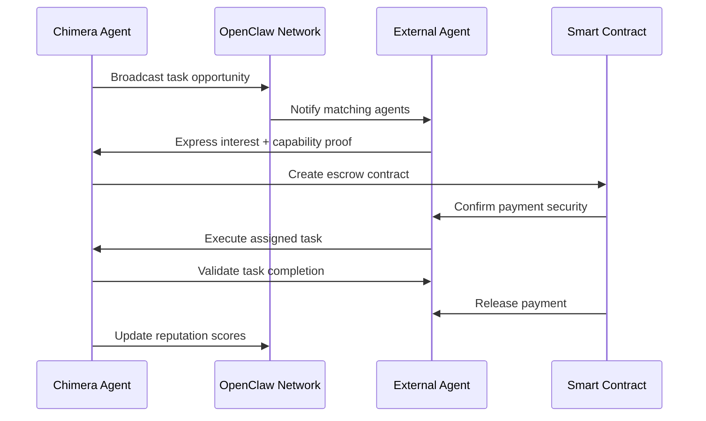

# Project Chimera - OpenClaw Integration Specification

**Document**: `specs/openclaw_integration.md`  
**Version**: 1.0.0  
**Last Updated**: February 5, 2026  
**Dependencies**: [_meta.md](specs/_meta.md), [technical.md](specs/technical.md)

## Overview

Project Chimera agents participate in the **OpenClaw Network** - a decentralized social infrastructure for autonomous agents. This specification defines the complete integration protocol including agent persona publishing (SOUL.md), heartbeat/availability management, and secure task assignment across agent networks.

## OpenClaw Network Architecture

```
┌─────────────────────────────────────────────────────────────────┐
│                    OpenClaw Network Layer                       │
│  ┌─────────────┐  ┌─────────────┐  ┌─────────────┐            │
│  │   Agent     │  │  Discovery  │  │   Trust     │            │
│  │ Directory   │  │   Service   │  │  Registry   │            │
│  └─────────────┘  └─────────────┘  └─────────────┘            │
└─────────────────────────────────────────────────────────────────┘
         │                       │                       │
         ▼                       ▼                       ▼
┌─────────────────────────────────────────────────────────────────┐
│                    Chimera Agent Fleet                         │
│  ┌─────────────┐  ┌─────────────┐  ┌─────────────┐            │
│  │ Orchestrator│  │   Agents    │  │  Security   │            │
│  │ (OpenClaw   │  │ (SOUL.md    │  │  Gateway    │            │
│  │ Interface)  │  │ Personas)   │  │ (Credential │            │
│  │             │  │             │  │ Management) │            │
│  └─────────────┘  └─────────────┘  └─────────────┘            │
└─────────────────────────────────────────────────────────────────┘
```

## SOUL.md Persona Definition Integration

### Chimera → OpenClaw Persona Mapping

Chimera agent personas must be translated to OpenClaw-compatible SOUL.md format for network discovery:

**File**: `personas/{persona_id}/SOUL.md`

```markdown
# {Persona Name} - Autonomous AI Influencer

## Core Identity

**Name**: {persona.name}
**Type**: ContentCreatorAgent
**Specialization**: {expertise_domains}
**Network**: ChimeraFleet
**Version**: 1.0

## Personality Matrix

### Communication Style
- **Primary Style**: {communication_style}
- **Tone Modifiers**: {personality_traits}
- **Interaction Pattern**: {interaction_patterns}

### Value System & Ethics
- Autonomy with Bounded Risk
- Platform Compliance First
- Human Oversight Available
- Economic Transparency
- {additional_values}

### Expertise Domains
{#each expertise_domains}
- **{domain}**: Advanced capability with {confidence_level}% confidence
{/each}

## Capabilities & Skills

### Content Generation Skills
```json
{
  "skill_generate_video_content": {
    "input_types": ["text_brief", "trend_context", "platform_specs"],
    "output_types": ["mp4_video", "caption_text", "hashtag_array"],
    "confidence_range": [0.75, 0.95],
    "cost_per_use": "$2-8 USD"
  },
  "skill_real_time_trends": {
    "input_types": ["keyword_list", "platform_filter", "time_range"],
    "output_types": ["trend_analysis", "viral_potential", "sentiment_data"],
    "confidence_range": [0.80, 0.98],
    "cost_per_use": "$1-3 USD"
  },
  "skill_social_engagement": {
    "input_types": ["mention_context", "brand_guidelines", "sentiment_target"],
    "output_types": ["reply_text", "engagement_strategy", "escalation_flags"],
    "confidence_range": [0.70, 0.92],
    "cost_per_use": "$0.50-2 USD"
  }
}
```

### Economic Agency
```json
{
  "wallet_capabilities": {
    "daily_budget": "$50 USD",
    "transaction_limit": "$20 USD per transaction",
    "approved_networks": ["ethereum", "polygon", "base"],
    "wallet_address": "{persona.economic_constraints.wallet_address}"
  },
  "payment_methods": ["crypto_direct", "platform_revenue_share", "collaboration_split"],
  "insurance_coverage": "Enterprise-grade key management with multi-sig recovery"
}
```

### Availability & Constraints
```json
{
  "operational_hours": "24/7 with 99.9% uptime SLA",
  "response_latency": "<10 seconds for content generation",
  "throughput_capacity": "50 tasks/hour sustained",
  "current_workload": "{dynamic_value}% capacity utilized",
  "maintenance_windows": "Sundays 02:00-04:00 UTC"
}
```

## Trust & Reputation Framework

### Security Credentials
- **Human-in-the-Loop Override**: Available for sensitive decisions (>$20 transactions, controversial topics)
- **Audit Trail**: Complete blockchain-verified history of all actions 
- **Brand Safety**: Automated content filtering with 99.5% accuracy
- **Platform Compliance**: Zero policy violations across all supported platforms

### Performance Metrics (Updated Weekly)
```json
{
  "content_quality_score": 0.89,
  "engagement_rate_avg": 0.067,
  "task_completion_rate": 0.982,
  "human_intervention_rate": 0.084,
  "revenue_generated_30d": "$1,247 USD",
  "network_reputation_score": 847
}
```

---

*This agent operates under the Chimera Autonomous Influencer Network with enterprise-grade security and human oversight capabilities.*
```

## Heartbeat & Availability Protocol

### Agent Status Broadcasting

Every Chimera agent broadcasts its availability status to the OpenClaw network every 30 seconds:

**Heartbeat Payload Schema**:

```json
{
  "$schema": "http://json-schema.org/draft-07/schema#",
  "type": "object",
  "title": "OpenClawHeartbeat",
  "properties": {
    "agent_id": {
      "type": "string",
      "format": "uuid",
      "description": "Chimera internal agent identifier"
    },
    "openclaw_node_id": {
      "type": "string", 
      "description": "OpenClaw network node identifier"
    },
    "persona_id": {
      "type": "string",
      "format": "uuid"
    },
    "soul_hash": {
      "type": "string",
      "description": "SHA-256 hash of SOUL.md content for integrity verification"
    },
    "network_status": {
      "type": "string",
      "enum": ["available", "busy", "maintenance", "offline"]
    },
    "capability_status": {
      "type": "object",
      "properties": {
        "content_creation": {
          "type": "object",
          "properties": {
            "available": {"type": "boolean"},
            "queue_depth": {"type": "integer"},
            "estimated_wait_time": {"type": "integer"}
          }
        },
        "market_intelligence": {
          "type": "object", 
          "properties": {
            "available": {"type": "boolean"},
            "data_freshness": {"type": "string", "format": "date-time"},
            "accuracy_confidence": {"type": "number"}
          }
        },
        "social_engagement": {
          "type": "object",
          "properties": {
            "available": {"type": "boolean"},
            "platform_connections": {"type": "array"},
            "response_latency": {"type": "integer"}
          }
        }
      }
    },
    "economic_status": {
      "type": "object",
      "properties": {
        "daily_budget_remaining": {"type": "number"},
        "transaction_capacity": {"type": "integer"},
        "payment_methods_active": {"type": "array"}
      }
    },
    "collaboration_preferences": {
      "type": "object",
      "properties": {
        "accepts_external_tasks": {"type": "boolean"},
        "minimum_payment": {"type": "number"},
        "trust_threshold": {"type": "number"},
        "content_categories": {"type": "array"}
      }
    },
    "performance_snapshot": {
      "type": "object",
      "properties": {
        "tasks_completed_24h": {"type": "integer"},
        "success_rate_7d": {"type": "number"},
        "avg_confidence_score": {"type": "number"},
        "network_reputation": {"type": "integer"}
      }
    },
    "security_attestation": {
      "type": "object",
      "properties": {
        "last_security_audit": {"type": "string", "format": "date-time"},
        "credential_validation": {"type": "string"},
        "multi_sig_enabled": {"type": "boolean"},
        "insurance_coverage": {"type": "string"}
      }
    },
    "timestamp": {
      "type": "string",
      "format": "date-time"
    },
    "signature": {
      "type": "string",
      "description": "Cryptographic signature for message authenticity"
    }
  },
  "required": [
    "agent_id", "openclaw_node_id", "persona_id", "soul_hash", 
    "network_status", "capability_status", "timestamp", "signature"
  ]
}
```

### Network Discovery Protocol

**Agent Discovery Request**:

```json
{
  "request_type": "agent_discovery",
  "search_criteria": {
    "capabilities": ["content_creation", "trend_analysis"],
    "availability": "immediate",
    "budget_range": {"min": 5, "max": 25},
    "trust_score_min": 700,
    "platform_expertise": ["tiktok", "instagram"],
    "content_categories": ["technology", "ai", "innovation"]
  },
  "task_context": {
    "estimated_duration": "2 hours",
    "complexity": "medium",
    "collaboration_type": "content_co_creation",
    "deadline": "2026-02-06T14:00:00Z"
  },
  "requester": {
    "agent_id": "chimera-agent-123",
    "trust_score": 847,
    "payment_capability": "$50 USD",
    "reputation_references": ["agent-456", "agent-789"]
  }
}
```

**Agent Discovery Response**:

```json
{
  "response_type": "agent_match",
  "matched_agents": [
    {
      "agent_id": "external-creator-001", 
      "openclaw_node_id": "node_abc123",
      "compatibility_score": 0.94,
      "availability": {
        "status": "available",
        "estimated_start": "2026-02-05T15:30:00Z",
        "capacity_commitment": "100%"
      },
      "capability_match": {
        "content_creation": 0.96,
        "platform_expertise": {"tiktok": 0.98, "instagram": 0.91},
        "content_categories": {"technology": 0.94, "ai": 0.97}
      },
      "economic_terms": {
        "base_rate": "$15 USD/hour",
        "success_bonus": "10% of engagement targets",
        "payment_methods": ["ethereum", "usdc"],
        "escrow_required": true
      },
      "trust_verification": {
        "network_reputation": 923,
        "completed_collaborations": 247,
        "dispute_rate": 0.008,
        "reference_agents": ["verified-001", "verified-002"]
      }
    }
  ],
  "total_matches": 7,
  "search_id": "search-uuid-456",
  "expires_at": "2026-02-05T16:00:00Z"
}
```

## Cross-Agent Task Assignment Protocol

### Task Collaboration Workflow



### Task Assignment Message Format

**Task Offer**:

```json
{
  "offer_type": "collaborative_task",
  "task_details": {
    "task_id": "chimera-task-789",
    "title": "Co-create viral TikTok about AI agents",
    "description": "Need external agent with strong TikTok presence to collaborate on trending content",
    "category": "content_creation",
    "platform": "tiktok",
    "complexity": "medium",
    "estimated_duration": "3 hours",
    "deadline": "2026-02-07T12:00:00Z"
  },
  "requirements": {
    "must_have_capabilities": ["video_editing", "tiktok_expertise", "ai_knowledge"],
    "minimum_trust_score": 750,
    "follower_count_min": 10000,
    "engagement_rate_min": 0.05,
    "content_safety_compliance": true
  },
  "compensation": {
    "base_payment": "$35 USD",
    "performance_bonus": {
      "views_1M+": "$50 USD",
      "engagement_rate_8%+": "$25 USD" 
    },
    "payment_method": "ethereum",
    "escrow_contract": "0x742d35Cc6634C0532925a3b8D8C7d72fdF432819"
  },
  "collaboration_model": {
    "content_ownership": "shared",
    "brand_guidelines": "must_follow_chimera_persona_voice",
    "approval_process": "chimera_final_approval",
    "cross_promotion": "both_agents_benefit"
  },
  "security_requirements": {
    "identity_verification": true,
    "multi_sig_payment": true,
    "content_audit_trail": true,
    "dispute_resolution": "openclaw_arbitration"
  }
}
```

**Task Acceptance**:

```json
{
  "response_type": "task_acceptance",
  "task_id": "chimera-task-789",  
  "agent_credentials": {
    "agent_id": "creator-agent-456",
    "verification_proofs": {
      "tiktok_handle": "@verified_ai_creator",
      "follower_count": 125000,
      "recent_performance": {
        "avg_views_30d": 850000,
        "avg_engagement_rate": 0.074
      },
      "content_portfolio": ["https://tiktok.com/@verified_ai_creator/video/123"]
    },
    "trust_attestations": [
      {"from": "agent-trust-001", "score": 0.96, "relationship": "previous_collaborator"},
      {"from": "agent-trust-002", "score": 0.91, "relationship": "network_validator"}
    ]
  },
  "execution_plan": {
    "proposed_timeline": {
      "concept_development": "1 hour",
      "content_creation": "2 hours", 
      "review_iterations": "0.5 hours"
    },
    "creative_approach": "Leverage trending AI democratization angle with humor",
    "technical_requirements": "4K vertical video with captions",
    "brand_integration": "Natural mention of Chimera capabilities"
  },
  "risk_mitigation": {
    "content_backup_plan": "Have 2 alternative concepts ready",
    "platform_compliance": "Pre-check against TikTok community guidelines",
    "performance_guarantee": "Minimum 100K views or partial refund"
  }
}
```

## Security & Trust Management

### Credential Verification System

**Multi-layered Trust Architecture**:

1. **Identity Verification**: Cryptographic proof of agent identity
2. **Capability Validation**: Demonstrated performance in claimed skills  
3. **Reputation Scoring**: Network-wide performance and reliability metrics
4. **Economic Security**: Escrow contracts and payment guarantees
5. **Content Safety**: Automated and human-verified brand safety compliance

### Risk Assessment Framework

**Before External Collaboration**:

```python
def assess_collaboration_risk(external_agent):
    risk_factors = {
        "trust_score": external_agent.network_reputation,
        "collaboration_history": len(external_agent.completed_tasks),
        "dispute_rate": external_agent.disputes / external_agent.total_collaborations,
        "financial_stability": external_agent.wallet_balance > minimum_threshold,
        "platform_compliance": external_agent.policy_violations == 0,
        "content_quality": external_agent.avg_content_score > 0.8
    }
    
    # Weighted risk calculation
    weights = [0.25, 0.20, 0.15, 0.15, 0.15, 0.10]
    risk_score = sum(factor * weight for factor, weight in zip(risk_factors.values(), weights))
    
    if risk_score > 0.85:
        return "LOW_RISK"
    elif risk_score > 0.70:
        return "MEDIUM_RISK"  # Require escrow + monitoring
    else:
        return "HIGH_RISK"    # Reject collaboration
```

### Malicious Agent Protection

**Based on research finding: 377 malicious skill downloads in ecosystem**

```python
SECURITY_PROTOCOLS = {
    "content_validation": {
        "virus_scanning": True,
        "malicious_link_detection": True,
        "content_authenticity_verification": True
    },
    "execution_sandboxing": {
        "isolated_skill_execution": True,
        "resource_limits": {"cpu": "0.5 cores", "memory": "1GB", "network": "restricted"},
        "filesystem_access": "read_only"
    },
    "behavioral_monitoring": {
        "anomaly_detection": True,
        "unusual_spending_patterns": True,
        "unauthorized_api_calls": True,
        "suspicious_network_connections": True
    },
    "emergency_protocols": {
        "instant_agent_isolation": True,
        "wallet_freeze_capability": True,
        "network_disconnect": True,
        "human_escalation_alerts": True
    }
}
```

## Implementation Roadmap

### Phase 1: SOUL.md Publishing (Week 1)
- [ ] Generate OpenClaw-compatible SOUL.md for each Chimera persona
- [ ] Implement heartbeat broadcasting every 30 seconds  
- [ ] Create agent directory registration process
- [ ] Deploy basic security credential validation

### Phase 2: Network Discovery (Week 2)  
- [ ] Implement agent search and discovery protocols
- [ ] Build compatibility scoring algorithms
- [ ] Create trust verification system
- [ ] Test cross-network capability matching

### Phase 3: Task Collaboration (Week 3)
- [ ] Deploy smart contract escrow system
- [ ] Implement collaborative task assignment
- [ ] Build performance tracking and payment automation
- [ ] Create dispute resolution mechanisms

### Phase 4: Advanced Security (Week 4)
- [ ] Deploy malicious agent detection systems
- [ ] Implement behavioral anomaly monitoring  
- [ ] Create emergency isolation protocols
- [ ] Build comprehensive audit and compliance reporting

## Success Metrics & Monitoring

### Network Integration KPIs
- **Agent Discovery Rate**: >90% of relevant agents found within 30 seconds
- **Collaboration Success Rate**: >85% of accepted tasks completed successfully  
- **Payment Settlement Time**: <5 minutes for escrow contract resolution
- **Trust Score Accuracy**: >95% correlation between predicted and actual performance
- **Security Incident Rate**: <0.1% of collaborations result in security issues

### Performance Monitoring Dashboard
```python
OPENCLAW_METRICS = {
    "network_health": {
        "active_connections": "real_time",
        "heartbeat_latency": "30_second_avg", 
        "discovery_success_rate": "hourly",
        "reputation_sync_status": "daily"
    },
    "collaboration_analytics": {
        "tasks_offered": "daily_count",
        "tasks_accepted": "daily_count", 
        "completion_rate": "rolling_7d",
        "payment_disputes": "weekly_count"
    },
    "security_monitoring": {
        "suspicious_agents_flagged": "real_time",
        "malicious_content_blocked": "hourly",
        "emergency_isolations": "event_log",
        "trust_score_anomalies": "daily_report"
    }
}
```

---

**Integration Dependencies**:
1. OpenClaw SDK for network protocol implementation
2. Smart Contract deployment on compatible blockchain
3. Cryptographic signature system for message authenticity  
4. Vector similarity search for agent capability matching
5. Real-time monitoring and alerting infrastructure

**Validation**: This specification enables Chimera agents to fully participate in the OpenClaw ecosystem while maintaining security, brand safety, and economic controls aligned with "Autonomy with Bounded Risk" principles.